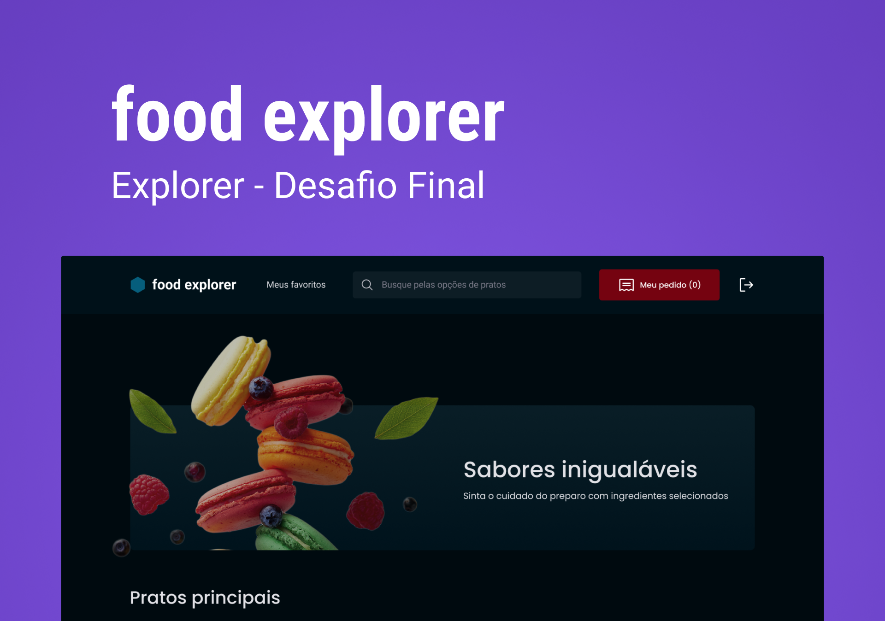

## Food Explorer - API 🚀

  

  💻<a href="#-about">About</a> 
  🛠<a href="#-tech-stack">Tech Stack</a>

---

## 💻 About

This is an API project for a fictional restaurant. It has the administrator and user. The admin is the person responsible for the restaurant, so he can create, view, edit and delete a dish at any time. Each dish must contain an image, a name, a category, a brief description, the ingredients and their price. By clicking on add dish, the administrator will receive a success message and will be redirected to the main page. The user will view all registered dishes and, when clicking on a dish, will be redirected to a new screen with more information provided about it.

In this challenge, the following topics were addressed:

- Express
- Routes and http method;
- Params;
- Controllers;
- Middleware;
- SQL;
- Migrations;
- Query Builder;
- Knex;
- JWT;
- Disk Storage;
- Cors;
---

## 🛠 Tech Stack

The following tools were used in the construction of the project:
- [Express](https://expressjs.com/)
- [CORS](https://expressjs.com/en/resources/middleware/cors.html)
- [KnexJS](http://knexjs.org/)
- [SQLite](https://github.com/mapbox/node-sqlite3)
- [Node](https://github.com/node)
- [Multer](https://github.com/expressjs/multer)

---

Made with 💜 by Henrique Thomazin 👨🏻 [Linkedin](https://www.linkedin.com/in/henrique-thomazin-068922162/)

